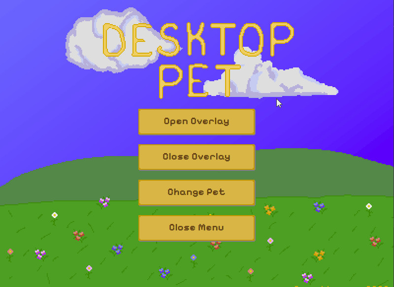
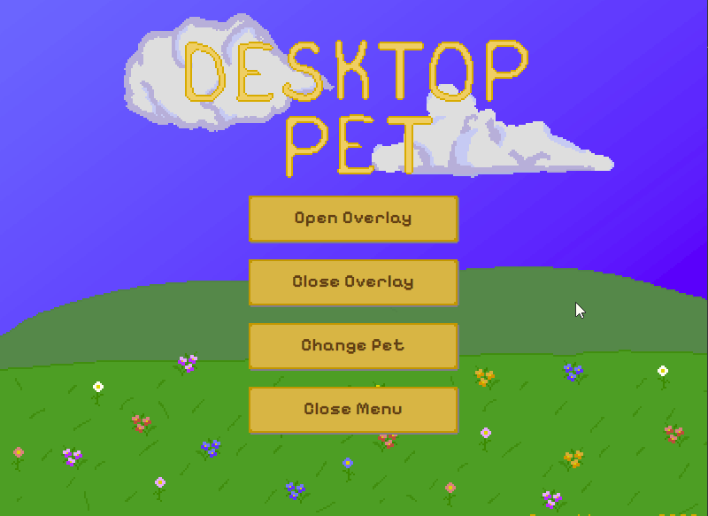

# Desktop Pet

Desktop Pet is a cozy pixel-art desktop companion built with Tauri, React, TypeScript, and PixiJS. It runs as a lightweight desktop overlay with selectable animated pets, a clock/timer HUD, system tray controls, and pet reminders when your timer finishes.



## Features

- Animated pixel-art home screen
- Transparent always-on-top desktop overlay
- Selectable animated pets
- Persistent pet selection
- Clock and countdown timer HUD
- Editable timer duration
- Timer completion sound
- Pet speech bubble reminders
- System tray controls for opening/closing the menu and overlay
- Packaged Windows installer

## Demo

### Pet Selection

Choose between available pets and instantly update the overlay without restarting the app.



### Overlay Timer

Use the overlay as a small desktop timer. When the timer finishes, the pet displays a reminder message.


## Tech Stack

- Tauri
- React
- TypeScript
- PixiJS
- Vite
- CSS
- Aseprite

## Installation

Download the latest Windows installer from the [Releases](../../releases) page.

Note: The Windows installer is currently unsigned, so Windows SmartScreen may show an “Unknown publisher” warning. This is expected for an unsigned portfolio app. The source code is available in this repository for review.

Run:

```txt
Desktop-Pet-Setup-v1.0.0.exe
```

## Development

Install dependencies:

```bash
npm install
```

Run the app in development mode:

```bash
npm run tauri dev
```

Build the frontend:

```bash
npm run build
```

Build the Windows installer:

```bash
npm run tauri build
```

## Project Highlights

This project focuses on combining a polished pixel-art interface with native desktop behavior. The core challenge was making the app feel like a lightweight companion rather than a standard web app running in a window.

Notable implementation details include:

- Separate Tauri windows for the main menu and transparent overlay
- Live pet updates across windows using shared state and Tauri events
- PixiJS-based sprite animation system with reusable pet definitions
- Local persistence for selected pet, timer duration, and HUD display mode
- Custom countdown timer logic with completion events, alarm sound, and pet messages
- System tray integration for controlling the app after the main menu is hidden
- Custom pixel-art UI assets, animated background layers, and packaged Windows release workflow

## Roadmap

Planned future improvements:

- Additional pets and animations
- Settings screen for timer, clock, and overlay preferences
- Pet-specific sound effects
- More idle behaviors and personality messages
- Additional UI polish and accessibility improvements

## License

This project is licensed under the [MIT License](LICENSE).